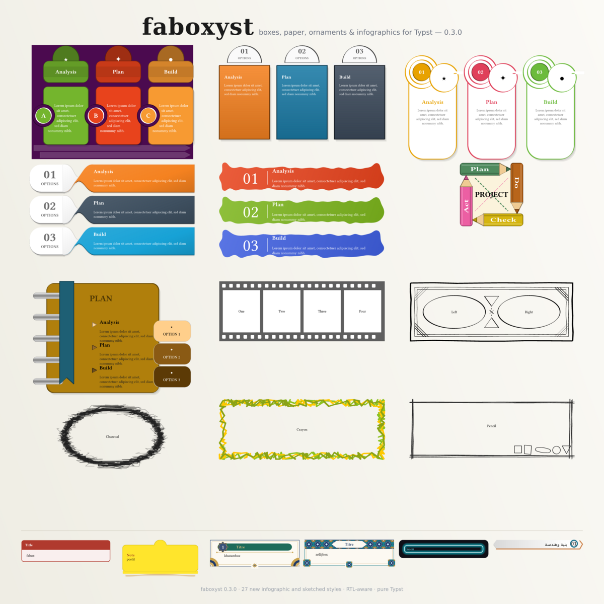

# faboxyst



A broad library of **Typst boxes, paper components, frames, ornaments,
infographics and full-page covers**, inspired by LaTeX's *tcolorbox*, with
first-class **right-to-left (Arabic)** support. Version **0.3.0**, Typst **0.15.1+**.
Manuals: [English](docs/faboxyst-0.3.0-manual-en.pdf) · [Français](docs/faboxyst-0.3.0-manual-fr.pdf)
(every function with its full parameter table and a live example).

```typst
#import "@preview/faboxyst:0.3.0": *
#show: faboxyst.with(theme: themes.notebook)

#fabox(title: [Note])[A titled box.]
#postit(title: [Remember])[A paper note.]
#numbered-header-box(title: [Step], number: 12)[A numbered panel.]

// 0.3.0: infographics, mirrored automatically in RTL
#twisted-ribbon-rows(steps: (
  (title: [Analysis], body: [Collect the facts.], icon: [★]),
  (title: [Plan], body: [Choose a method.], icon: [✦]),
))
```

`faboxyst.with(...)` is a **show rule**, not a document class: it does not set
page size or margins.

## Install and build

### From Typst Universe

```typst
#import "@preview/faboxyst:0.3.0": *
```

Typst downloads `@preview/cetz:0.5.2` and `@preview/nibart:0.3.0` by itself.
The *local edition* of this package (separate archive) is imported as
`@local/faboxyst:0.3.0` and needs `@local/nibart:0.3.0`.

### Compile the sources

From the package directory (the `lib.typ` import is used instead of the `@preview` one):

```sh
python3 docs/build-manual.py both   # needs pypdf; builds the manual chapter by chapter
typst compile examples/quickstart.typ --root . --package-path ../../..
typst compile examples/rtl-boxes.typ --root . --package-path ../../..
typst compile examples/print-mode.typ --root . --package-path ../../..
```

The package depends on `@preview/cetz:0.5.2`, fetched by Typst when needed, and
`@preview/nibart:0.3.0` (broad-nib strokes of the antique register). There is no
WebAssembly and no binary asset: the sketch engine is pure Typst. No fonts
are bundled. Arabic examples prefer installed Arabic faces when available and
fall back to DejaVu; the optional Latin/display faces include xkcd Script,
Bevan and Comic Neue.

## Changes since 0.1.0

The 0.1.0 Universe release established `fabox`, `fabox-sign`, `fabox-note`,
semantic callouts, the original textbook plates, `sashbox` / `ruban`, and
`ticket` / `ticketbox` components. The newer source keeps those
entry points and adds the following groups:

- **Direction and layout:** broader automatic `direction: auto` support,
  RTL-aware text alignment, logical tab/badge/fastener placement, Arabic
  examples, and RTL fixes for paper stocks, tickets, bindings and frames.
- **Paper and stationery:** torn and ruled sheets, notepad, index and grid
  cards, deckle tags, lesson cards, coil-bound notebook.
- **More box families:** ornate and zellij frames, rosette and lace frames,
  flags, banners, relief/inset shadows, vintage plaques, wood and torn-page
  styles, and content-adaptive components.
- **Classroom graphics:** meters, pictograms, programme plates, inline
  highlights/marks, pattern fills and the `pgfornament` motif bank.
- **Covers and page design:** ten full-page book-cover styles, and antique plate/patent layouts with elliptical-nib engraving.
- **0.3.0 additions:** 18 infographic functions (`puzzle-tab-cards`, `twisted-ribbon-rows`,
  `index-notebook`, `film-strip`, …) and 4 sketched frames (`vintage-frame`, `charcoal-frame`,
  `crayon-frame`, `pencil-sketch-frame`), all drawn with nibart pens, mirrored in RTL;
  automatic sizing for content boxes such as `plankbox`,
  `mark(fill:, inset:)`, the `themes.antique` register, and local
  `postit-butterfly`, `garnet-box`, `numbered-header-box` and monochrome print
  support, plus the local `folded-banner` ribbon and `abstract-textbox` card
  styles inspired by the supplied slide templates.

For a release-by-release inventory, see [`CHANGELOG.md`](CHANGELOG.md).

## Main component families

- **Core and semantic boxes:** `fabox`, `fabox-sign`, `fabox-note`,
  `note`, `tip`, `warning`, `example`, `definition`, `sketch-box` and
  numbered exercise boxes, `folded-banner` ribbons and `abstract-textbox` cards.
- **Paper:** `postit`, `postit-butterfly`, `garnet-box`, `sticky`, `post-it`,
  `torn-note`, `ruled-sheet`, `stamp-card`, `grid-note`, `index-card`,
  `deckle-tag`, `notepad`, `lesson-card`, `ticket`, `folder` and `terminal`.
- **Frames and ornaments:** `ornatebox` and its presets, `lacebox`,
  `rosettebox`, `vintageframe`, `vintagebox`, `volutebox`, `plankbox`,
  `tornpage`.
- **School and textbook graphics:** `meter`, `competence-crayon`,
  `banner-tri`, `sale-poster`, `leconbox`, `pinbox`, `brushbox`,
  `matierebox`, `crestbox`, `helixbox`, `circuitbox`, `plannerbox`,
  `screwbox` and related plates.
- **Full-page designs:** `book-cover`, `plate-page` / `planche`,
  `patent-page` / `brevet`, and `bound-page` (spiral binding). Full-page *frames* live in the
  companion package **nibframe** (see below).
- **Drawing utilities:** `halftone` / `trame`, `tikzpattern` / `motif-tikz`,
  `pgfornament`, `lace`, and the motif helpers exported from `lib.typ`.

The complete API and option index are in the manual (`docs/manual.typ`, built
chapter by chapter with `python3 docs/build-manual.py both`; English and French). Focused
examples are in [`examples/`](examples/), with a gallery in
[`examples/gallery.typ`](examples/gallery.typ).

## Hand-drawn mode and the theme

`fabox` (and `fabox-sign`, `fabox-note`, `example-header`) draw crisp by default, and
turn hand-drawn as soon as the theme sets a `roughness`: one line roughens a whole
document, `0` keeps it crisp. The box's own `roughness:` is multiplied by the theme's,
and `rough: true` / `rough: false` on a box (or in the theme) always wins.

```typst
#for r in (0, 1, 3) {
  show: faboxyst.with(theme: make-theme(roughness: r))
  box(fabox(colour: rgb("#1565c0"), width: 2.1cm)[r= #r])
}
#fabox(rough: false)[Always crisp]
```

Note that a `show: faboxyst.with(...)` changes the theme for the rest of the document.
`sketch-box` reads the theme's `roughness` directly (it is always hand-drawn).

## Post-it

`postit` draws its lifted shadow and inset rule inside the sheet (`shadow-inside: true`,
the default); `shadow-inside: false` hangs the shadow below the sheet instead.

## RTL alignment

Set the text direction before the components. Direction-aware boxes use the
logical `start` edge for body text (right in RTL); titles, tabs, badges, ticket
stubs, rings and other logical fasteners mirror as appropriate. A component's
`direction:` argument can force `ltr` or `rtl` when it differs from the
surrounding paragraph.

```typst
#set text(lang: "ar", dir: rtl)
#fabox(title: [ملاحظة], tab: "plaque")[
  يتبع النص الحافة المنطقية اليمنى تلقائياً.
]
#postit(title: [مراجعة], direction: rtl)[
  ورقة لاصقة ومحاذاة إلى اليمين.
]
```

The RTL showcase is [`examples/rtl-boxes.typ`](examples/rtl-boxes.typ); the
print-mode RTL regression is [`tests/test-print-rtl.typ`](tests/test-print-rtl.typ).
`align(...)` supplied explicitly by a caller still takes precedence.

## Monochrome print mode

Apply the print theme to the whole document:

```typst
#show: faboxyst.with(theme: "print")
// Equivalent: #show: faboxyst.with(theme: themes.print)
```

Or limit it to a group:

```typst
#print-group[
  #numbered-header-box(title: [Étape], number: 12)[Texte.]
  #postit(title: [Note])[Une note blanche, avec son ombre.]
]
```

Print mode uses white primary surfaces and black text/rules, while converting
colored secondary details to monochrome. Existing colored shadow paints are
converted to gray without replacing their source tone or changing their
configured opacity, geometry or offset. Normal styling remains the default
outside the print theme/group. See [`examples/print-mode.typ`](examples/print-mode.typ)
and the regression sources under [`tests/`](tests/).

## Selected 0.3.0 additions

`plankbox` and applicable content boxes measure their contents with
`width: auto` / `height: auto`; explicit lengths and ratios remain available.
`mark` supports `fill:` for closed marks and `(x:, y:)` or scalar `inset:`
values for hand-drawn marks.

The newer note/header and folded-banner components are exported from `lib.typ`: 

```typst
#postit(title: [To remember])[A short note.]
#postit-butterfly(title: [Lifted note])[A lifted note.]
#garnet-box[ما يجب معرفته]
#numbered-header-box(title: [Concept essentiel], number: 12)[Texte.]
#folded-banner(
  title: [Lorem Ipsum], body: [A short explanation.], number: [01],
  icon: [⚙], colour: rgb("#47BDE5"),
)
#abstract-textbox(
  title: [Lorem Ipsum], body: [An abstract card with an offset backing.],
  number: [01], icon: [⚙], colour: rgb("#F3921B"),
)
#alternating-block-process(steps: (
  (title: [Define], body: [Agree on the goal.]),
  (title: [Plan], body: [Choose the next action.]),
))
```

The two sticky-note variants share a continuous outer contour between the
upper semicircle and note frame. `numbered-header-box` keeps a square body,
slightly overhanging rounded title band, and a number badge sized to fit
multi-digit values. `folded-banner` adds a numbered, double-fold ribbon with
an optional user-supplied icon; its number can be automatic or explicit, and
its folds follow RTL direction. `width: auto` fills the line; set a length or
ratio such as `82%` for a narrower ribbon. See `examples/folded-banners.typ`
for the four-color composition and `tests/test-folded-banner.typ` for RTL/print
coverage. `abstract-textbox` recreates the rounded colored card, curved upper
cutout, dark offset backing, icon and accent number. The backing gap accepts
one shared offset or independently configurable x/y offsets; width, colors,
text and RTL/print styling are also adjustable. `examples/abstract-textboxes.typ` shows the
same four cards in LTR and RTL, while `examples/abstract-textboxes-print.typ`
shows their monochrome versions. `tests/test-abstract-textbox.typ` covers RTL,
backing-gap control and print colors. `alternating-block-process` lays out
numbered, alternating color cards with four filled chevron ribbons modeled on the
supplied PowerPoint paths; its step dictionaries
accept `title`, `body`, optional `icon`, `print-icon`, `number` and `colour`.
The order, chevrons, icon/number positions and text alignment mirror in RTL;
the chevrons overlay the card faces. The inner background cutout follows the
rounded card contour from the supplied PowerPoint; `notch-colour` customizes
its fill (default `#F2EFF1`, white in print). In print, cards are white with
black rules/body text; ribbons, numbers and icons are medium gray. White
knockouts hide the frame under ribbon gaps. Supply a gray `print-icon` variant
for images. See
`examples/alternating-block-process.typ` (LTR and RTL),
`examples/alternating-block-process-print.typ`, and
`tests/test-alternating-block-process.typ`. `alternating-line-block-process`
adds tall rounded cards with alternating title tabs and outlined arrow
connectors that alternate between the top and bottom edges. Optional pictograms
sit in the arrowheads; `width`, `height`, `gap`, `arrow-outset` and `radius` are
configurable, and RTL reverses the sequence and connector direction. Print uses
white cards, gray arrows/icons, light-gray title tabs, and black text/outlines.
See `examples/alternating-line-block-process.typ`,
`examples/alternating-line-block-process-print.typ`, and
`tests/test-alternating-line-block-process.typ`.

`banners-with-circles` lays out numbered, colored horizontal ribbons with
an overlapping circle, title, body and optional icon. Each step may provide
`number`, `colour`, `accent`, `icon` and `print-icon`; RTL mirrors the circle
and icon positions. Set `width` to control the gallery width, `columns` to set
banners per row, and `gap` / `row-gap` to tune the layout. Print mode uses white
faces with gray circles, bottom strips and icons. See
`examples/banners-with-circles.typ`,
`examples/banners-with-circles-print.typ`, and
`tests/test-banners-with-circles.typ`.

`calendar-list` arranges colored calendar cards in a configurable grid. Each
card has a title band, twin binder tabs, an open U-shaped outline, centered
icon and supporting text. `width`, `columns`, `gap`, `row-gap`, card height,
colors and typography can be adjusted; RTL reverses card order. Print mode
uses white cards, light-gray title bands, gray borders and icons, and black
text. See `examples/calendar-list.typ`,
`examples/calendar-list-print.typ`, and `tests/test-calendar-list.typ`.

`capsule-text-boxes` creates floating capsule cards with a gray numbered
header, icon, curved white seam and colored lower text panel. `width`, `columns`,
`gap`, `row-gap`, `height`, colors and typography can be customized; RTL mirrors card order while both
directions use the same seam sweep. Print mode uses white bodies, gray headers and outlines,
and black text. See `examples/capsule-text-boxes.typ`,
`examples/capsule-text-boxes-print.typ`, and `tests/test-capsule-text-boxes.typ`.

`cards-with-corner-sleeve` adds rounded cards with an overlapping, colored
diagonal corner flap and an optional icon. `width`, `columns`, `gap`, `row-gap`,
card height, flap dimensions, colors and typography are configurable; RTL moves
the flap to the opposite corner and reverses card order. Print uses white cards,
gray flap fills, outlines and icons, and black text. See
`examples/cards-with-corner-sleeve.typ`,
`examples/cards-with-corner-sleeve-print.typ`, and
`tests/test-cards-with-corner-sleeve.typ`.

`connected-cards-process` displays rounded white cards inside thick colored
frames, joined by curved, pinched connectors. `width`, `columns`, `gap`,
`row-gap`, card height, connector shape, colors and typography are configurable;
RTL reverses card order, and print mode uses pale-gray frames and connectors
with monochrome text and icons. See `examples/connected-cards-process.typ`,
`examples/connected-cards-process-print.typ`, and
`tests/test-connected-cards-process.typ`.

`cornered-cards` adds white cards with contrasting borders, large diagonal icon
flaps in the upper leading corner, and numbered flaps in the lower trailing
corner. `width`, `columns`, `gap`, `row-gap`, card height, corner size/overhang,
colors, and typography are configurable; RTL mirrors the corner positions and
card order. Print mode uses gray flaps and outlines. See
`examples/cornered-cards.typ`, `examples/cornered-cards-print.typ`, and
`tests/test-cornered-cards.typ`.

`cube-block-list` presents layered 3D blocks with a title face and a colored
front panel. `width`, `columns`, `gap`, `row-gap`, title/body face sizes, depth,
palette and typography are configurable; RTL reverses order and mirrors the
block depth. Print mode uses gray title/side faces and white panels. See
`examples/cube-block-list.typ`, `examples/cube-block-list-print.typ`, and
`tests/test-cube-block-list.typ`.

`double-duo-neumorphic` lays out soft cards with alternating inset icon wells
and dual shadows. An individual card may use `raised: true` and `icon-fill:`
for a colored raised pad. Grid size, colors and typography are configurable;
RTL mirrors the icon pattern and card order. Print mode uses white cards and
gray outlines, wells, and icons. See `examples/double-duo-neumorphic.typ`,
`examples/double-duo-neumorphic-print.typ`, and
`tests/test-double-duo-neumorphic.typ`.

`three-step-highlight-cards` lays out three equal rounded cards with thick
colored borders, centered numbered tabs with downward points, and a divided
icon/title/body area. Steps accept `title:`, `body:`, optional `icon:`,
`print-icon:`, `number:` and per-card `colour:`. Card width, height, spacing,
tab dimensions, icon size, palette and typography are configurable; RTL reverses
the card sequence and mirrors the icon/text arrangement. Print mode uses gray
tabs, outlines, dividers and monochrome pictograms. See
`examples/three-step-highlight-cards.typ`,
`examples/three-step-highlight-cards-print.typ`, and
`tests/test-three-step-highlight-cards.typ`.

`hand-drawn-speech-bubbles` draws three editable vector shapes: a quotation
bubble, an angled dialogue bubble, and a thought cloud. Each step accepts
`title:` and `body:` and can set `kind:` (`quote`, `speech`, or `thought`),
`colour:`, `title-colour:` and `body-colour:`. Width, columns, height, gaps,
outline and typography are configurable. RTL reverses the sequence and mirrors
tails/quote details. Set `dark: true` for a dark slide; print mode switches to
white faces, black outlines, and gray accents. See the light and dark examples,
the LTR/RTL print gallery, and `tests/test-hand-drawn-speech-bubbles.typ`.

`four-feature-icon-cards` arranges feature panels in a two-by-two grid. Each
card has a colored rounded outline, a circular icon medallion with dotted arc
details, a colored title bar, and a concise body. Items accept `title:` and
`body:` plus optional `icon:`, `dark-icon:`, and `print-icon:`. Palette, width,
card height, gaps, icon size, and typography are configurable. RTL mirrors the
icon/text sides and reverses grid reading order; `dark: true` switches to a
dark-slide treatment, and print mode uses gray frames, dots, icon rings, and
header bars. See the light LTR, dark RTL, and monochrome print examples.

`six-step-numbered-card-list` presents a two-column grid of rounded cards with
subtle shadows, numbered circular badges, bold headings, and short descriptions.
It accepts `title:`, `body:`, optional `number:` and per-card `colour:`. Grid
width, columns, card height, spacing, badge size, colors, and typography are
configurable. RTL reverses reading order and moves the badge to the opposite
edge. Use `dark: true` over a dark slide, or `monochrome: true` for one badge
color; print mode switches the cards, badges, shadows, and text to grayscale.
See the light LTR, dark RTL, print LTR/RTL examples, and
`tests/test-six-step-numbered-card-list.typ`.

`concentric-tier-cards` nests three rounded frames to present broad scope,
focused scope, and a central priority. `levels:` takes three outer-to-inner
items with `title:`, `body:`, and optional `icon:`/`print-icon:` content. Frame
width/height, inset, core-panel size, colors, and typography are configurable.
RTL mirrors the label/icon groups; `dark: true` supports a dark slide. Print
mode switches the frames and central panel to grayscale. Pass `background:`
when using a custom page fill so the broken outer-frame accents blend in. See
the light LTR, dark RTL, print LTR/RTL examples, and
`tests/test-concentric-tier-cards.typ`.

`l-shaped-header-box` is a single reusable text box with a colored L-shaped
header, tall tinted panel, and overlapping circular icon badge. It accepts
`header:`, `title:`, `body:`, and optional `icon:` content; dimensions, badge,
spacing, colors, and type sizes can be customized. Direction may be forced
with `direction: ltr` or `direction: rtl`, or inferred from the surrounding
text. `dark: true` adapts the panel to a dark background; print theme mode
uses grayscale. See the light LTR, dark RTL, monochrome print LTR/RTL examples,
and `tests/test-l-shaped-header-box.typ`.

`text-box-tag` draws one colorful, notched text tag: a rounded text panel points
into a contrasting icon bay. Set `title:`, `body:`, and optional `icon:`; the
icon side follows the reading direction by default and can be set to `start` or
`end`. Width, panel proportions, pointer geometry, corner style, colors, and
typography are configurable. `dark: true` adjusts the drop shadow for dark
slides, and print theme mode switches both panels and text to grayscale. See
the light LTR, dark RTL, monochrome print LTR/RTL examples, and
`tests/test-text-box-tags.typ`. Adapted from [PresentationGO's Text Boxes
(Tags)](https://www.presentationgo.com/presentation/text-boxes-tags-powerpoint-google-slide/);
only the single reusable tag component is included, not the source layout.

`frame-accent-block` pairs a colored square, an offset open outline, and an
icon above a title and supporting copy. Each call renders one reusable block,
not the four-column source composition. Control the block width, square size,
offset, frame weight, accent and text colors, icon, and typography. RTL mirrors
the accent/frame offset; `dark: true` switches the frame and copy to light ink,
while print theme mode uses a grayscale accent with a black frame. See the light
LTR, dark RTL, monochrome print LTR/RTL examples, and
`tests/test-frame-accent-block.typ`. Adapted from
[PresentationGO's Frame Accent Blocks](https://www.presentationgo.com/presentation/frame-accent-blocks-powerpoint-google-slides/).

`tabbed-folder-box` is one folder-shaped information box, with a raised tab,
colored title band, pale or dark body panel, and narrow matching footer strip.
Pass `title:`, `body:`, and optional `icon:`/`print-icon:`; width, tab geometry,
colors, corner radius, and typography can be customized. RTL mirrors the tab
and icon/title order. `dark: true` uses a deep body panel; print mode switches
the surfaces and copy to grayscale. See the light LTR, dark RTL, monochrome
print LTR/RTL examples, and `tests/test-tabbed-folder-box.typ`. Adapted from
[PresentationGO's Tabbed Folder Grid](https://www.presentationgo.com/presentation/tabbed-folder-grid-powerpoint-google-slides/);
only one reusable folder box is included, not the six-box grid.

`perspective-text-box` draws one slanted front panel with a darker side face
for a subtle three-dimensional effect. Add `title:`, `body:`, and optional
`icon:`/`print-icon:` content. Face width, height, side depth, slant, colors,
and typography are configurable; RTL mirrors the depth edge. `dark: true`
selects light text, while print mode turns both faces and text grayscale. See
the light LTR, dark RTL, monochrome print LTR/RTL examples, and
`tests/test-perspective-text-box.typ`. Adapted from
[PresentationGO's Perspective Text Boxes](https://www.presentationgo.com/presentation/perspective-text-boxes-powerpoint-google-slides/);
only one reusable panel is included, not the multi-box progression.

`peak-header-box` is a single rounded card with a white top field that dips to
a central peak over its colored text area. Add `title:`, `body:`, optional
`icon:`/`print-icon:`, and an optional `number:`. The card dimensions, notch,
colors, spacing, and typography are configurable. RTL mirrors the icon and
number positions; `dark: true` adapts the shadow and the print theme switches
the surfaces and text to grayscale. See the light LTR, dark RTL, monochrome
print LTR/RTL examples, and `tests/test-peak-header-box.typ`. Adapted from
[PresentationGO's Peak Header Cards](https://www.presentationgo.com/presentation/peak-header-cards-powerpoint/);
only one reusable box is included, not the connected four-card sequence.

`pocket-card-box` is a single rounded content card with a raised, colored tab
and a circular lip that overlaps the card's top edge. Add `title:`, `body:`,
and optional `icon:`/`print-icon:`. Card and tab dimensions, colors, shadows,
and typography are configurable; body text follows the requested direction.
`dark: true` tunes the shadow for dark pages, and print mode uses grayscale
with a print-safe icon. See the light LTR, dark RTL, monochrome print LTR/RTL
examples and `tests/test-pocket-card-box.typ`. Adapted from
[PresentationGO's Pocket Card Process](https://www.presentationgo.com/presentation/pocket-card-process-powerpoint/);
only the individual pocket card is included, not the process row.

`folder-step-box` reproduces one layered folder component: a colored folder
back with a thick outline sits behind a contrasting stepped content panel. Add
`title:`, `body:`, an optional `number:`, and `icon:`/`print-icon:` content.
Folder and panel proportions, overhang, tab and step geometry, colors, and text
are configurable. RTL mirrors the folder tab, step, icon, and number positions;
`dark: true` switches the foreground panel for dark pages, and print mode uses
grayscale. See the light LTR, dark RTL, monochrome print LTR/RTL examples and
`tests/test-folder-step-box.typ`. Adapted from [PresentationGO's Folder Step
Trio](https://www.presentationgo.com/presentation/folder-step-trio-powerpoint-google-slides/);
only the single folder box is included, not the three-card slide.

`folder-text-block` adapts one Folder Text Blocks card as a standalone reusable
component: its rounded folder shoulder rises at the leading edge, curves into
a slim accent lip, and opens onto a pale title field. The lower half keeps the
source's split layout—a soft icon tile beside the saturated text panel. Pass
`title:` and `body:`, with optional `number:`, `icon:` and `print-icon:`. Width,
height, column proportion, shoulder depth, colors, shadow and typography are
configurable. RTL mirrors the tab contour, accent lip and lower columns; setting
`dark: true` keeps the same vivid card palette on a dark page, as in the reference.
Print mode uses distinct grayscale levels and a print-safe icon. See the light
LTR, dark RTL, monochrome print LTR/RTL examples and
`tests/test-folder-text-block.typ`. Adapted from [PresentationGO's Folder Text
Blocks](https://www.presentationgo.com/presentation/folder-text-blocks-powerpoint-google-slides/);
only one reusable block is included, not the source's four-card grid.

`folder-text-box` adapts one of the source's wide folder cards: a raised tab
contour surrounds the number, the title and copy share the main colored face,
and a pale S-curved inset carries the icon. Pass `title:` and `body:`, with
optional `number:`, `icon:` and `print-icon:`. Card proportions, icon-panel
width, content area, colors, shadow and typography are configurable. RTL
mirrors the folder contour and icon inset; `dark: true` keeps the source's vivid
palette on a dark page. Print mode uses differentiated grays. See the light
LTR, dark RTL, monochrome print LTR/RTL examples and
`tests/test-folder-text-box.typ`. Adapted from [PresentationGO's Folder Text
Boxes](https://www.presentationgo.com/presentation/folder-text-boxes-powerpoint-google-slides/);
only one box is included, not the source's three-box row or explanatory text
below it.

The standalone PNG previews are compiled only for these new components. See the
sticky-note examples and [`GUIDE-POSTIT-FR.md`](GUIDE-POSTIT-FR.md).

## Infographic cards and sketched frames

`puzzle-tab-cards`, `folded-tab-cards`, `half-disc-tab-cards`, `u-backed-cards`,
`circle-head-outline-cards`, `dashed-pill-cards`, `skewed-badge-cards`,
`badge-timeline-cards`, `ring-linked-boxes`, `wire-linked-pills`,
`brush-stroke-rows`, `twisted-ribbon-rows`, `bubble-tail-boxes`,
`striped-poster-cards`, `pencil-frame-flow`, `index-notebook`, `film-strip`,
`chevron-slideshow-frame` take `steps: ((title:, body:, icon:, label:, colour:), …)`
and mirror in RTL. `twisted-ribbon-rows` also takes `twist:` (width of the bow-tie neck, 70 %) and `depth:` (raised rim, 0.06 cm). `vintage-frame`, `charcoal-frame`, `crayon-frame` and
`pencil-sketch-frame` frame any content. See `examples/infographic-cards.typ`,
`examples/infographic-stacks.typ`, `examples/sketch-frames.typ`.

## Page frames: moved to nibframe

The six full-page frame functions (`ornate-pages`, `rosette-pages`,
`volute-pages`, `plank-pages`, `torn-pages`, `coil-pages`) were removed in
0.3.0. Full-page frames are now provided by **nibframe** (styles `dedication`,
`classic`, `label`, `plank`, `torn`, `coil`, …). `plate-page`, `patent-page`
and `bound-page` remain here.

## Manual, examples and tests

The bilingual manuals are shipped as PDF in `docs/` ([EN](docs/faboxyst-0.3.0-manual-en.pdf), [FR](docs/faboxyst-0.3.0-manual-fr.pdf)); rebuild them with `python3 docs/build-manual.py both`. They cover the public API, setup,
themes, RTL behavior, local components and print mode. The most useful
starting points are:

- [`examples/quickstart.typ`](examples/quickstart.typ) — a first page;
- [`examples/rtl-boxes.typ`](examples/rtl-boxes.typ) — Arabic and forced
  direction examples;
- [`examples/print-mode.typ`](examples/print-mode.typ) — normal and print
  themes, including a scoped group;
- [`examples/folded-banners.typ`](examples/folded-banners.typ) — the four-row folded-ribbon style;
- [`examples/abstract-textboxes.typ`](examples/abstract-textboxes.typ) — four offset slide cards in LTR and RTL;
- [`examples/abstract-textboxes-print.typ`](examples/abstract-textboxes-print.typ) — their black-and-white print variants;
- [`examples/alternating-block-process.typ`](examples/alternating-block-process.typ) — alternating blocks in LTR and RTL;
- [`examples/alternating-block-process-print.typ`](examples/alternating-block-process-print.typ) — the monochrome print gallery;
- [`examples/banners-with-circles.typ`](examples/banners-with-circles.typ) — adjustable-width numbered banners in LTR and RTL;
- [`examples/banners-with-circles-print.typ`](examples/banners-with-circles-print.typ) — their print-mode gallery;
- [`examples/calendar-list.typ`](examples/calendar-list.typ) — calendar cards in LTR and RTL;
- [`examples/calendar-list-print.typ`](examples/calendar-list-print.typ) — their monochrome print gallery;
- [`examples/capsule-text-boxes.typ`](examples/capsule-text-boxes.typ) — floating capsule cards in LTR and RTL;
- [`examples/capsule-text-boxes-print.typ`](examples/capsule-text-boxes-print.typ) — their monochrome print gallery;
- [`examples/cards-with-corner-sleeve.typ`](examples/cards-with-corner-sleeve.typ) — diagonal sleeve cards in LTR and RTL;
- [`examples/cards-with-corner-sleeve-print.typ`](examples/cards-with-corner-sleeve-print.typ) — their print-mode gallery;
- [`examples/connected-cards-process.typ`](examples/connected-cards-process.typ) — connected cards in LTR and RTL;
- [`examples/connected-cards-process-print.typ`](examples/connected-cards-process-print.typ) — their monochrome print gallery;
- [`examples/cornered-cards.typ`](examples/cornered-cards.typ) — diagonal icon and number corners in LTR and RTL;
- [`examples/cornered-cards-print.typ`](examples/cornered-cards-print.typ) — their monochrome print gallery;
- [`examples/cube-block-list.typ`](examples/cube-block-list.typ) — isometric block cards in LTR and RTL;
- [`examples/cube-block-list-print.typ`](examples/cube-block-list-print.typ) — their monochrome print gallery;
- [`examples/double-duo-neumorphic.typ`](examples/double-duo-neumorphic.typ) — alternating raised and inset icon wells in LTR and RTL;
- [`examples/double-duo-neumorphic-print.typ`](examples/double-duo-neumorphic-print.typ) — their monochrome print gallery;
- [`examples/neumorphic-text-panel-review-set.typ`](examples/neumorphic-text-panel-review-set.typ) — one text panel in neutral, accent, Arabic RTL, and print variants;
- [`examples/horizontal-chevron-block-review-set.typ`](examples/horizontal-chevron-block-review-set.typ) — a single horizontal chevron text segment in LTR, reversed, Arabic RTL, and print modes;
- [`examples/vertical-chevron-list-item-review-set.typ`](examples/vertical-chevron-list-item-review-set.typ) — one numbered chevron-list row in LTR, reversed, Arabic RTL, and print;
- [`examples/stacked-banner-row-review-set.typ`](examples/stacked-banner-row-review-set.typ) — one folded stacked-banner row at a time, with color, Arabic RTL, and print variants;
- [`examples/text-box-display-card-review-set.typ`](examples/text-box-display-card-review-set.typ) — one vertical text-display card per page, with accent, Arabic RTL, and print variants;
- [`examples/quad-step-card-review-set.typ`](examples/quad-step-card-review-set.typ) — one portrait step card per page, with accent, Arabic RTL, and print variants;
- [`examples/three-color-infographic-card-review-set.typ`](examples/three-color-infographic-card-review-set.typ) — individual card plus shared-ribbon stack in LTR, Arabic RTL, and print;
- [`examples/three-step-highlight-cards.typ`](examples/three-step-highlight-cards.typ) — numbered three-card process in LTR and RTL;
- [`examples/three-step-highlight-cards-print.typ`](examples/three-step-highlight-cards-print.typ) — its monochrome print gallery;
- [`examples/hand-drawn-speech-bubbles.typ`](examples/hand-drawn-speech-bubbles.typ) — three vector bubble forms on a light slide;
- [`examples/hand-drawn-speech-bubbles-dark.typ`](examples/hand-drawn-speech-bubbles-dark.typ) — dark-background RTL treatment;
- [`examples/hand-drawn-speech-bubbles-print.typ`](examples/hand-drawn-speech-bubbles-print.typ) — monochrome LTR and RTL examples;
- [`examples/four-feature-icon-cards.typ`](examples/four-feature-icon-cards.typ) — 2×2 icon cards in LTR;
- [`examples/four-feature-icon-cards-dark.typ`](examples/four-feature-icon-cards-dark.typ) — dark-background RTL variant;
- [`examples/four-feature-icon-cards-print.typ`](examples/four-feature-icon-cards-print.typ) — monochrome LTR and RTL galleries;
- [`examples/six-step-numbered-card-list.typ`](examples/six-step-numbered-card-list.typ) — light numbered grid in LTR;
- [`examples/six-step-numbered-card-list-dark.typ`](examples/six-step-numbered-card-list-dark.typ) — dark-background RTL version;
- [`examples/six-step-numbered-card-list-print.typ`](examples/six-step-numbered-card-list-print.typ) — monochrome print LTR and RTL;
- [`examples/concentric-tier-cards.typ`](examples/concentric-tier-cards.typ) — nested scope cards in light LTR;
- [`examples/concentric-tier-cards-dark.typ`](examples/concentric-tier-cards-dark.typ) — dark-slide RTL version;
- [`examples/concentric-tier-cards-print.typ`](examples/concentric-tier-cards-print.typ) — monochrome print LTR and RTL;
- [`examples/l-shaped-header-box.typ`](examples/l-shaped-header-box.typ) — a single L-shaped text box in light LTR;
- [`examples/l-shaped-header-box-dark.typ`](examples/l-shaped-header-box-dark.typ) — the same box in dark RTL;
- [`examples/l-shaped-header-box-print.typ`](examples/l-shaped-header-box-print.typ) — monochrome print LTR and RTL;
- [`examples/text-box-tags.typ`](examples/text-box-tags.typ) — one notched tag in light LTR;
- [`examples/text-box-tags-dark.typ`](examples/text-box-tags-dark.typ) — dark RTL treatment;
- [`examples/text-box-tags-print.typ`](examples/text-box-tags-print.typ) — monochrome print LTR and RTL;
- [`examples/frame-accent-block.typ`](examples/frame-accent-block.typ) — a single offset-frame block in light LTR;
- [`examples/frame-accent-block-dark.typ`](examples/frame-accent-block-dark.typ) — dark RTL variant;
- [`examples/frame-accent-block-print.typ`](examples/frame-accent-block-print.typ) — monochrome print LTR and RTL;
- [`examples/tabbed-folder-box.typ`](examples/tabbed-folder-box.typ) — one folder-tab box in light LTR;
- [`examples/tabbed-folder-box-dark.typ`](examples/tabbed-folder-box-dark.typ) — dark RTL treatment;
- [`examples/tabbed-folder-box-print.typ`](examples/tabbed-folder-box-print.typ) — monochrome print LTR and RTL;
- [`examples/perspective-text-box.typ`](examples/perspective-text-box.typ) — one perspective panel in light LTR;
- [`examples/perspective-text-box-dark.typ`](examples/perspective-text-box-dark.typ) — dark RTL variant;
- [`examples/perspective-text-box-print.typ`](examples/perspective-text-box-print.typ) — monochrome print LTR and RTL;
- [`examples/peak-header-box.typ`](examples/peak-header-box.typ) — one peaked-header box in light LTR;
- [`examples/peak-header-box-dark.typ`](examples/peak-header-box-dark.typ) — dark RTL version;
- [`examples/peak-header-box-print.typ`](examples/peak-header-box-print.typ) — monochrome print LTR and RTL;
- [`examples/pocket-card-box.typ`](examples/pocket-card-box.typ) — one pocket card in light LTR;
- [`examples/pocket-card-box-dark.typ`](examples/pocket-card-box-dark.typ) — dark RTL variant;
- [`examples/pocket-card-box-print.typ`](examples/pocket-card-box-print.typ) — monochrome print LTR and RTL;
- [`examples/folder-step-box.typ`](examples/folder-step-box.typ) — one layered folder box in light LTR;
- [`examples/folder-step-box-dark.typ`](examples/folder-step-box-dark.typ) — dark RTL variant;
- [`examples/folder-step-box-print.typ`](examples/folder-step-box-print.typ) — monochrome print LTR and RTL;
- [`examples/folder-text-block.typ`](examples/folder-text-block.typ) — one Folder Text Blocks box in light LTR;
- [`examples/folder-text-block-dark.typ`](examples/folder-text-block-dark.typ) — dark RTL treatment;
- [`examples/folder-text-block-print.typ`](examples/folder-text-block-print.typ) — monochrome print LTR and RTL;
- [`examples/folder-text-box.typ`](examples/folder-text-box.typ) — one S-inset folder text box in light LTR;
- [`examples/folder-text-box-dark.typ`](examples/folder-text-box-dark.typ) — dark RTL version;
- [`examples/folder-text-box-print.typ`](examples/folder-text-box-print.typ) — monochrome print LTR and RTL;
- [`examples/covers.typ`](examples/covers.typ),
  [`examples/ornate.typ`](examples/ornate.typ),
  [`examples/antique.typ`](examples/antique.typ) — larger feature demos.

Regression sources: `tests/test-print-all.typ`, `test-print-rtl.typ`,
`test-print-group.typ`, `test-print-cover.typ`, and `test-postit.typ`.

## Credits and licences

The package follows the *tcolorbox* design tradition. The sketch engine draws
on Rough.js/TikZ techniques. Third-party-derived files retain their own
licences: the package is distributed with the SPDX expression in
[`typst.toml`](typst.toml); see the headers of `src/pgfornament.typ`,
`src/antique.typ`, `src/tornpage.typ`, and the assets for scope and attribution.

FERGOUS Abdelhak
